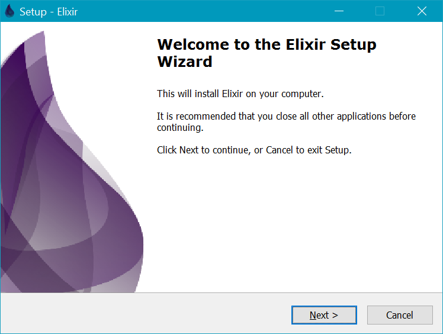

# elixir-windows-setup

Part of the Elixir on Windows Google Summer of Code 2014 project, this installer sets up [Elixir](http://elixir-lang.org/) on a Windows machine.

## Features

* Downloads and installs the latest Elixir version, or another version the user selects
* Offers to installer Erlang and add the Erlang directory to the system's Path variable
* Adds Elixir to the system's Path variable
* Creates shortcuts to IEx and the uninstaller

## Structure

The **offline installer** ([Elixir.iss](Elixir.iss)) packages a specific Elixir release to install, and also can append the system's Path variable appropriately.  This kind of installer is currently not distributed in binary form.

The **web installer** ([ElixirWeb.iss](ElixirWeb.iss)) is what's currently distributed (see [Releases](https://github.com/chyndman/elixir-windows-setup/releases)). The **web installer** itself does not install Elixir.  It packages the files necessary to download an Elixir release of the users choosing, build an **offline installer** against this release, and run the resulting **ofline installer** that performs the actual Elixir installation.  It also handles installing Erlang and adding it to the system's Path variable.

## Build Instructions

First, download the Unicode version of Inno Setup (`isetup-X.Y.Z-unicode.exe` from [jrsoftware.org](http://www.jrsoftware.org/isdl.php#stable)) and install it, making sure to keep the "Install Inno Setup Preprocessor" checkbox checked when asked.  Then, clone this repo (`elixir-windows-setup`) to your system.

To build the **web installer**, follow these steps:

1. Download and install the [Inno Download Plugin](https://code.google.com/p/inno-download-plugin/).
2. Download the [7-Zip Command Line Version](http://www.7-zip.org/download.html) and extract it to `7za920` in your Documents folder (i.e. `C:\Users\YourUserName\Documents\7za920`).  You can redefine the `PATH_TO_7ZA` macro if you have this extracted elsewhere.
3. Open `elixir-windows-setup\ElixirWeb.iss` in the Inno Setup Compiler.
4. Click "Compile" to build an installer in `elixir-windows-setup/Output`.

To build the **offline installer** follow these steps:

1. Extract Precompiled.zip of the desired [Elixir Release](https://github.com/elixir-lang/elixir/releases/) into `elixir-windows-setup\elixir`
2. Open `elixir-windows-setup\Elixir.iss` in the Inno Setup Compiler.
3. Click "Compile" to build an installer in `elixir-windows-setup/Output`.

## Acknowledgements

#### [Inno Setup](http://www.jrsoftware.org/isinfo.php)
Copyright (C) 1997-2013 Jordan Russell. All rights reserved.
Portions Copyright (C) 2000-2013 Martijn Laan. All rights reserved.

#### [Inno Download Plugin](https://code.google.com/p/inno-download-plugin/)
Copyright (c) 2013-2014 Mitrich Software

#### [modpath.iss](http://legroom.net/software/modpath)
Copyright (c) Jared Breland

#### [7-Zip](http://www.7-zip.org/)
Copyright (C) 1999-2010 Igor Pavlov

#### [Elixir](http://elixir-lang.org/)
"Elixir" and the Elixir logo are copyright (c) 2012 Plataformatec.
